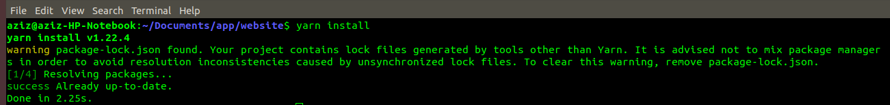
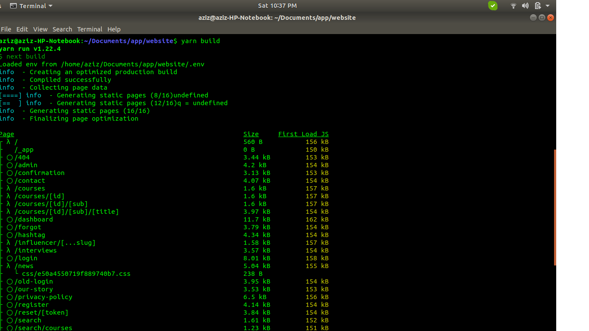
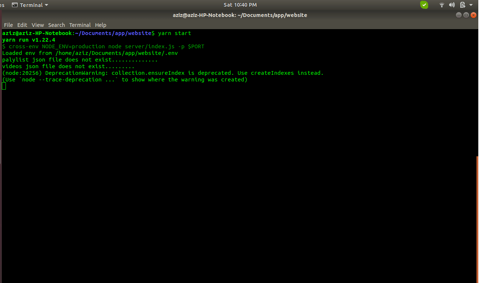

# Important steps for developers!

## How Developers start this application follow this steps!

first you need to clone the latest code from the github repository https://github.com/themoticom/website.git  and then you have website folder in your local machine open the terminal and type this command 

`git clone https://github.com/themoticom/website.git`

`cd website`

## Installing Dependencies using this command!
yarn install || npm install 

## Put the .env file in the app root directory its very important!

## Build the application using this command!
yarn build || npm run build

## Start the application using this command!
yarn start || npm run start

## Now your app is running on http://localhost:3000/

## 7 Best Rules for Good Coding Style!

### Readability!
Good code is written to be easily understood by colleagues.
It is properly and consistently formatted and uses clear, meaningful names for
functions and variables. Concise and accurate comments describe a natural
decomposition of the software’s functionality into simple and specific
functions. Any tricky sections are clearly noted. It should be easy to see why
the program will work and reason that it should work in all conceivable cases.

### Maintainability!
Code should be written so that it is straightforward for
another programmer to fix bugs or make changes to its functionality later.
Function should be general and assume as little as possible about preconditions.
All important values should be marked as constants which can be easily changed.
Code should be robust to handle any possible input and produce a reasonable
result without crashing. Clear messages should be output for input which is not
allowed.

### Comments!

**Note: Must write every single line comment for debugging and reading your code !**
Comments are the first step towards making computer program
human readable. Comments should explain clearly everything about a program
which is not obvious to a peer programmer. The volume of comments written is
meaningless, quality is all that counts.
Block comments are written using /* comments */ style. They should go at the top of every source
file and generally include your name, the date your code was written and
overall description of the purpose of that program. Block comments should also
precede most functions with a description of the function’s purpose; these can
be omitted for very short, obvious functions only.
Inline comments are written as //comments, they should go near important lines of code within
functions or with variables when they are initialized.

### Naming!
Names given to classes, variables, and functions should be
unambiguous and descriptive. Other guidelines for naming are:
Capitalization is used to separate multi-word names:
StoneMasonKarel.
The first letter of a class name is always capitalized:
GraphicsProgram
The first letter of a function or variable name is always in
lowercase: setFilled().
The names x and y should only be used to describe
coordinates.
The names i, j, and k should only be used as variables in
for loops.
Other one-letter names should be avoided: area = base *
height instead of a = b * h.
Names of constants are capitalized, with underscores to
separate words: BRICK_COLOR.
Use abbreviations with caution. max instead of maximum is
fine, but xprd instead of crossProduct is a problem.

### Indentation!
Indentation is used to clearly mark control flow in a
program. Within any bracketed block, all code is indented in one tab. This
includes the class body itself. Each additional for, while, if, or switch
structure introduces a new block which is indented, even if brackets are
omitted for one line statements. For if statements, any corresponding else
statements should line up

### White Space!
White space is meaningless to compilers, but should be used
consistently to improve readability. Typically three blank lines are left in
between functions. Individual blank lines are used within functions to separate
key sections. Use of spaces varies as well, but inserting one space usually
make expression more readable; next = 7 *
(prev – 1) is clear than next=7*(prev-1).

### Function Usage!
Function should be short and accomplish a clear, specific
task. As much as possible they should be considered “black boxes” which do not
depend on anything except their parameters and can be handle any possible input
gracefully. A common rule of thumb is the “Ten Line Rule”, usually function
longer than ten lines are trying to do too much and should be simplified.
Another important aspect of functions is that any repeated
segments of code should be made into a separate function. This will shorten
your program and improve readability.

# Precautions Everyone should be followed!
#### Without Comenting don't write code 
#### Don't load big size images for better website speed 
#### Dont write too much code in a single file you can devide the code into the components 
#### Don't push the code on github without Testing
#### Dont touch your team mate code

## Deploying an App to Heroku!
Heroku is a container-based cloud platform for deploying and managing applications. It also allows you to automate deploys and trigger them by pushing to repository's default branch.

### Create a New Heroku App!
When you have an account on Heroku, you should have access to its Dashboard. The Dashboard contains lists of all the connected apps and services. 

To create a new app find a “New” button and hit it. In a select chose “Create new app” option. It will redirect you to a page with the new app settings screen. There you will be able to choose a name for your app, and a region

The region can affect performance and download time. For example, for users in Europe app deployed to the US region might load a bit slower than for users in the US because of the distance a request should pass between a user and a server.

When it’s done, add a new pipeline with the button below. A Heroku pipeline is a set of actions being performed over your application. Let’s say you want not to just deploy an app, but to test is first and only then deploy—this set of testing and deploying actions is a pipeline.

Heroku Pipelines represent steps of the continuous delivery workflow. In this case you can select “Production” since we won’t run any tests and want to just deploy the application.

After it’s done, you will be asked about the deployment method. There might be 3 options:

Heroku Git, uses Heroku CLI (we will talk about it a bit later);

GitHub;

and Container Registry.
The first one is convenient when you have a git repository and you want to deploy an app right from the command line. If you have a Heroku CLI installed, there is a special command for deploying from the command line:
#### git push heroku deploy
 note the heroku deploy after push

But since we’re using GitHub select the “Connect to GitHub” method. Then select a repository to connect to from a list below. You might be asked for repository permissions. Again, try to keep third-party app access as minimal as possible. When you grant permissions to Heroku you can set up automatic deploys for some branch.

### Setup GitHub Actions
nd other routines. They allow you to create a custom life cycle for your app. So, you can setup code-linting, code-formatting, some code checks, and all. They are like robots that receive messages and do some stuff. 

Actions are being set up by YAML-files, that describe what to do and what triggers this action.

To tell GitHub that there is an action that should be played, create a directory called .github, mind the dot in front of the title. This is the directory that contains all the actions and workflows for this repository.

Inside of that directory create another one called workflows. A workflow is a set of actions. So if you want to chain some actions together in a list you can use a workflow. In workflows directory create a file called main.yml, this is the workflow. 

Open this file and paste this code inside:

name: Deploy

on:
  push:
    branches:
      - master

Let’s break it down. The first line describes the name of this workflow. When GitHub will run this workflow, in a workflow dashboard you will see a list of all created workflows. 

The next directive is on. It describes what events should trigger this workflow. In this case, workflow should be triggered on push event in the master branch of this repo. So when someone pushes to master branch this workflow will be played.

For deployment with Heroku, there is an action called “Deploy to Heroku”. 

jobs:
  build:
    runs-on: ubuntu-latest
    steps:
      - uses: actions/checkout@v2
      - uses: akhileshns/heroku-deploy@v3.2.6
        with:
          heroku_api_key: ${{secrets.HEROKU_API_KEY}}
          heroku_app_name: "YOUR APP's NAME"
          heroku_email: "YOUR EMAIL"
